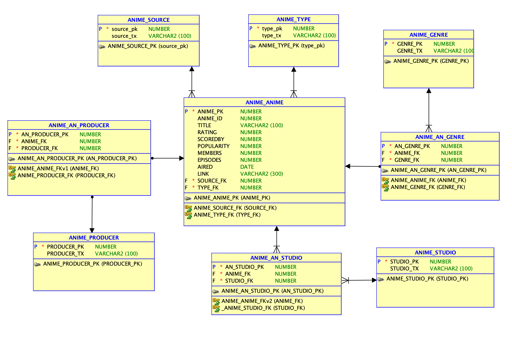

# Database-Management-Final-Project
This repository contains the components of a database management project focused on anime data analysis and management. It includes scripts, data files, and diagrams for creating, populating, and managing a relational database system.

## Table of Contents
1. [Project Overview](#project-overview)
2. [Folder and File Structure](#folder-and-file-structure)
3. [Setup and Installation](#setup-and-installation)
4. [Database Design](#database-design)
5. [How to use](#how-to-use)

## Project Overview
The goal of this project is to design and implement a relational database for managing anime-related data. This includes creating tables, relationships, and views while providing sample data for demonstration and testing. 
### Key Objectives:
* Organize anime data efficiently using relational database principles.
* Provide an ER diagram for database structure visualization.
* Demonstrate table creation, data population, and view creation.

## Folder and File Structure
| File Name     |Description                                        |
|-----------------------|-------------------------------------------|
| `Anime Stage.csv`     | Contains sample data for anime records.  |
| `Anime-Data-Report.pdf` | Detailed report explaining the project's purpose, design, and outcomes.     |
| `ER_Diagram.png`      | Entity-Relationship diagram visualizing the database schema.                   |
| `Populating_data`     | SQL script or instructions for populating tables with sample data.            |
| `README.md`           | Documentation file providing project details.                             |
| `Table_creation`      | SQL script for creating database tables and relationships.                        |
| `Views`               | SQL script for creating database views. |

## Setup and Installation
#### 1. Clone the Repository
* Download the data file 'ANIME_STAGE.CS'
#### 2. Set Up the Database
* Install a database management system (DBMS) such as Oracle SQL Developer.
* Use the 'Table_creation' file to create the database schema.
#### 3. Populate the Database
* Run the Populating_data script to insert Anime_Stage data into the tables. 
#### 4. Verify Views
* Execute the Views script to create pre-defined database views.
* Run the testing file to see the views.

## Database Design
### ER Diagram
The database structure is visualized in the ER_Diagram.png shown below: 

### Key Features
* Many-to-Many relationships are implemented using join tables.
* Efficient normalization of data to reduce redundancy.

## How to Use
1. Query the database to retrieve anime data based on various criteria.
2. Use the views for simplified access to aggregated or filtered data.
